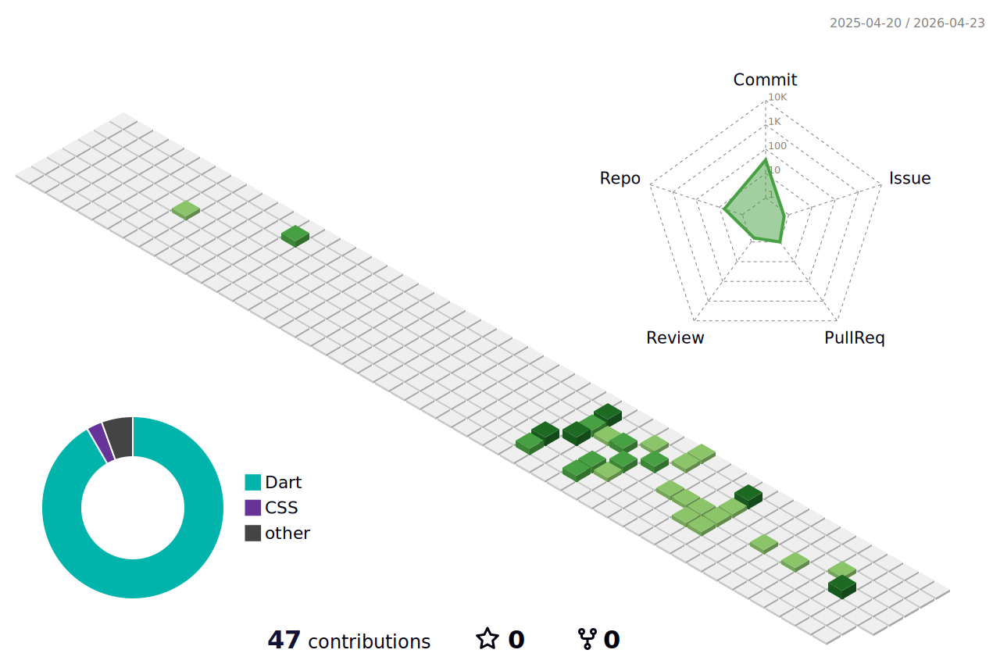

## Hello GitHub Fans 👋

<!-- 个人信息 + 右侧 GIF 优化布局 -->

  

    
  

---

<!-- 3D 贡献图表（保留原有特色） -->

  

<!-- 顶部联系信息 + 打字动画 -->

  

---

### 🛠 技术栈 | Tech Stack
<!-- 分类整理技术标签，优化视觉效果 -->

  <!-- 前端技术 -->
  

    <h4 style="color: #166534; margin-bottom: 15px;">🖥️ 前端 | Frontend</h4>
    

      
      
      
      
      
      
    

  

  <!-- 后端与数据库 -->
  

    <h4 style="color: #0c4a6e; margin-bottom: 15px;">🔧 后端与数据库 | Backend & DB</h4>
    

      
      
      
      
    

  

---

### 📫 联系我 | Contact Me

  
  <!-- 可添加其他社交账号 -->
  
  <!--  -->

<!-- 底部装饰 -->

  

> ***I love to make friends. So if you want to say hi, I'll be happy to meet you more!😊***
> 
> ⭐️ From [PhilRandWu](https://github.com/PhilRandWu)
